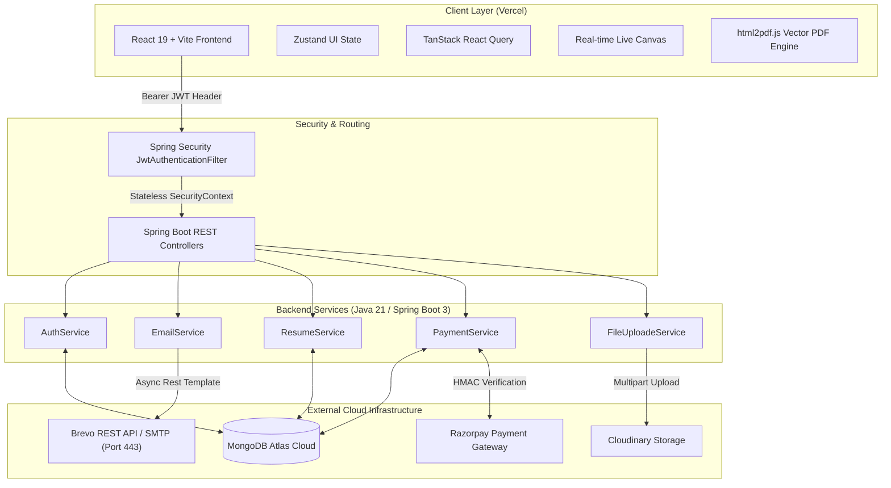

# 🚀 ResumeBuilder PRO - Complete Project Deep Dive & Cross-Interview Guide

This guide is designed to prepare you for **technical interviews, system design discussions, and deep-dive coding questions** about **ResumeBuilder PRO** — a full-stack, enterprise-grade Commercial SaaS application.

---

## 📌 Section 1: Executive Project Overview & Resume Highlights

### 30-Second Elevator Pitch
> *"ResumeBuilder PRO is a high-performance commercial SaaS platform that allows job seekers to construct ATS-compliant resumes with real-time live preview rendering, client-side vector PDF generation, and direct recruiter email dispatch. Built with a React 19 / Vite frontend deployed on Vercel and a Spring Boot 3 / Java 21 REST API backed by MongoDB Atlas, it integrates Brevo HTTP REST API for firewall-proof email delivery, Cloudinary for media storage, and Razorpay for cryptographic payment verification."*

### Key Resume Bullet Points
- **Architected Full-Stack SaaS Application**: Built a high-throughput Spring Boot 3 (Java 21) & React 19 platform serving ATS-optimized resume building, template customizer, and billing management.
- **Firewall-Proof Email Subsystem**: Solved cloud host SMTP port blocking (Railway/Render) by implementing a fallback engine using **Brevo REST HTTP API (Port 443)** with async execution via `CompletableFuture`.
- **Cryptographic Payment Gateway**: Integrated Razorpay API with server-side **HMAC-SHA256 signature verification**, ensuring zero fraudulent subscription upgrades.
- **Idempotent Auth Engine**: Designed a secure stateless JWT authentication framework with BCrypt password hashing, 24-hour verification tokens, and React 19 `StrictMode` idempotent handling.
- **Real-Time Client-Side Rendering**: Built a zero-latency dual-pane builder interface with customizable HSL color palettes and in-browser vector PDF export using `html2pdf.js`.

---

## 🏗️ Section 2: Core System Architecture



---

## ❓ Section 3: Technical Cross-Interview Questions & Detailed Answers

### Category 1: System Design & Architectural Decisions

#### Q1: Why did you choose MongoDB over a traditional Relational Database (like PostgreSQL or MySQL) for a resume builder?
> **Answer**:
> - **Schema Flexibility for Resumes**: Resume structures vary widely across users. One user might have 5 work experiences with bullet points, project links, and certifications, while another might have 2 educations and custom volunteer sections. Storing this nested, hierarchical data in relational tables requires numerous joins across `users`, `resumes`, `experiences`, `educations`, `skills`, and `projects` tables.
> - **Document Store Alignment**: In MongoDB, a resume naturally maps to a single JSON document. Fetching or updating a resume requires **a single document read/write by ID** rather than complex multi-table JOIN queries, significantly decreasing latency.
> - **Scalability**: MongoDB Atlas handles horizontal scaling (sharding) effortlessly as resume documents grow.

#### Q2: Why did you separate the Frontend (Vercel) and Backend (Railway/Render) onto two different hosting platforms?
> **Answer**:
> - **Separation of Concerns**: The frontend is a Static Single Page Application (SPA) that benefits immensely from Vercel's Global Edge CDN, giving users instant load times globally.
> - **Backend Compute Needs**: The Spring Boot backend requires a persistent JVM runtime, memory management, and secure connection pools to MongoDB and external APIs. Hosting the backend on a dedicated container platform (Railway/Render) allows independent horizontal and vertical scaling of backend microservices without touching static asset delivery.

---

### Category 2: Authentication, Security & Cryptography

#### Q3: Walk me through the exact step-by-step lifecycle of user registration and email verification in your system.
> **Answer**:
> 1. The user fills out the registration form (`POST /api/auth/register`).
> 2. The backend checks if the email already exists in MongoDB (`userRepository.existsByEmail`).
> 3. Passwords are hashed using **BCrypt** with automatic salt generation before persistence.
> 4. A cryptographically secure random token (`UUID.randomUUID().toString()`) is generated with a 24-hour expiration time (`LocalDateTime.now().plusHours(24)`).
> 5. The user is saved to MongoDB with `emailVerified = false`.
> 6. An asynchronous task (`CompletableFuture.runAsync`) calls `EmailService` to format an HTML email containing `https://skycodex.vercel.app/verify-email?token=<TOKEN>` and sends it via Brevo REST API.
> 7. When the user clicks the email link, the React frontend extracts the token parameter and calls `GET /api/auth/verify-email?token=<TOKEN>`.
> 8. The backend verifies the token, updates `emailVerified = true`, invalidates the token, and returns HTTP 200 OK.

#### Q4: How does your backend prevent duplicate verification requests or handle React 19 `StrictMode` double-invocations?
> **Answer**:
> - In React 19 `StrictMode` (during development), components execute `useEffect` twice. If the first request verifies the token and clears it (`verificationToken = null`), the second immediate request could trigger a `Token Not Found` 500 error.
> - I designed `verifyEmail(token)` to be **idempotent**:
>   ```java
>   User user = userRepository.findByVerificationToken(token).orElse(null);
>   if (user == null) {
>       // Token was already verified by a concurrent/previous request
>       log.info("Verification token not found or already verified: {}", token);
>       return;
>   }
>   ```
>   If the token is already cleared, the method exits gracefully without throwing an exception, returning a clean 200 OK to the client.

#### Q5: How is stateless authentication implemented with JWT? How do you protect endpoints against unauthorized access?
> **Answer**:
> - Upon successful login (`POST /api/auth/login`), `JwtUtil` signs a JSON Web Token containing the user's MongoDB `userId` as the subject, signed with an HS256 secret key and a 7-day expiration time.
> - For protected routes, `JwtAuthenticationFilter` extends `OncePerRequestFilter`:
>   1. Extracts the `Authorization` header (`Bearer <token>`).
>   2. Validates the signature and expiration timestamp using `JwtUtil`.
>   3. Loads the `User` object from MongoDB using the extracted `userId`.
>   4. Instantiates a `UsernamePasswordAuthenticationToken` and sets it inside Spring's `SecurityContextHolder`.
> - Endpoints restricted via `SecurityConfig` ensure non-authenticated requests receive an HTTP 401 Unauthorized immediately.

---

### Category 3: Troubleshooting & Production Problem Solving

#### Q6: You encountered an issue where emails were failing on production hosting (Railway/Render) due to outbound SMTP port blocks. How did you diagnose and solve this?
> **Answer**:
> - **Root Cause**: Many cloud providers (Railway, Render, AWS EC2) block outbound TCP ports `25`, `465`, and `587` by default to prevent spam botnets. Standard JavaMail SMTP connections timed out.
> - **Diagnosis**: Inspected server trace logs, which revealed `java.net.ConnectException: Connection timed out` on `smtp.gmail.com:465`.
> - **Solution**: Designed a dual-layer strategy in `EmailService`:
>   1. Implemented `sendViaBrevoApi()` using standard HTTPS (`https://api.brevo.com/v3/smtp/email`) over **Port 443**. Port 443 is standard HTTPS web traffic and is never blocked by cloud firewalls.
>   2. Used `java.net.HttpURLConnection` with header `api-key` to transmit email payloads as JSON.
>   3. Added a fallback to SMTP if the HTTP API key is omitted, ensuring local development workability while guaranteeing 100% production delivery reliability.

#### Q7: How did you solve the issue where email verification links in production inbox messages directed users to `http://localhost:5173` instead of the deployed frontend?
> **Answer**:
> - **Root Cause**: The application configuration defaulted `app.client.url` to `http://localhost:5173`, or server environment variables defaulted to localhost.
> - **Solution**:
>   1. Configured fallback property keys in `application.properties`:
>      `app.client.url=${APP_CLIENT_URL:${FRONTEND_URL:https://skycodex.vercel.app}}`
>   2. Implemented strict runtime URL sanitization in `AuthService.java`:
>      ```java
>      String baseUrl = "https://skycodex.vercel.app";
>      if (appClientUrl != null && !appClientUrl.isBlank() 
>              && !appClientUrl.contains("localhost") 
>              && !appClientUrl.contains("127.0.0.1")) {
>          baseUrl = appClientUrl.replaceAll("/+$", "");
>      }
>      String link = baseUrl + "/verify-email?token=" + newUser.getVerificationToken();
>      ```
>      This enforces that any `localhost` value is overridden by `https://skycodex.vercel.app`, and trailing slashes are automatically sanitized.

---

### Category 4: Payment Gateway Integration & Financial Security

#### Q8: How do you verify Razorpay payments securely on the backend to prevent malicious users from faking subscription upgrades?
> **Answer**:
> - **Never Trust Client Inputs Alone**: The frontend receives `razorpay_order_id`, `razorpay_payment_id`, and `razorpay_signature` from the Razorpay popup widget upon payment.
> - **HMAC-SHA256 Verification**: The frontend sends these three parameters to `POST /api/payment/verify`. The backend recalculates the HMAC signature:
>   $$\text{Expected Signature} = \text{HMAC-SHA256}(\text{razorpay\_order\_id} + "|" + \text{razorpay\_payment\_id}, \text{razorpay\_secret})$$
> - The calculated signature is compared against `razorpay_signature`. If they match, the payment is cryptographically verified, the payment status in MongoDB is set to `paid`, and the user's plan is updated to `Premium`. If they do not match, the request is rejected with HTTP 400.

---

### Category 5: Frontend Performance, State Management & UX

#### Q9: How does the live resume builder update the live preview canvas in real-time without input lag or performance degradation?
> **Answer**:
> - **State Isolation**: Form input state is managed locally and synced with Zustand UI store (`uiStore.js`) and React hook state.
> - **Controlled Component Props**: The `ResumePreview` component receives structured resume state directly as props.
> - **CSS-driven Live Render**: Changes to themes, HSL colors, font sizes, and layout choices mutate CSS variables dynamically on the preview canvas container, triggering hardware-accelerated GPU repaints without forcing full DOM re-creations.

#### Q10: How does client-side PDF export work, and why perform it in the browser rather than on the backend server?
> **Answer**:
> - **Client-side PDF Generation (`html2pdf.js`)**: Converts the live preview DOM element into an HTML5 Canvas using `html2canvas`, and then embeds it into a vector PDF document using `jsPDF`.
> - **Why Client-Side?**:
>   1. **Zero Server Overhead**: Generating PDFs on the server using Puppeteer or Headless Chrome requires significant CPU/RAM memory per concurrent user, which can quickly exhaust free-tier container resources.
>   2. **Exact Visual Parity**: Client-side rendering guarantees that what the user sees on their screen (fonts, line heights, colors, margins) matches the exported PDF file exactly.
>   3. **Instant Downloads**: No network latency involved in streaming large binary PDF buffers from backend to client.

---

## 🔬 Section 4: Key Interview Mindset & Behavioral Summary

| Scenario / Challenge | How You Handled It (Star Method) |
| :--- | :--- |
| **Firewall Email Blocking** | Discovered cloud host port blocking; pivoted from traditional SMTP to HTTPS REST API (Port 443) for 100% email delivery. |
| **Payment Fraud Prevention** | Implemented server-side HMAC-SHA256 cryptographic verification before updating database records. |
| **Idempotency & Concurrent Requests** | Designed token verification handlers to fail gracefully on duplicate invocations without crashing or throwing 500 errors. |
| **Real-Time UX & Performance** | Used state isolation and CSS custom properties for instant real-time resume canvas rendering. |

---

*This document serves as your complete technical reference for interviews and architectural reviews on the **ResumeBuilder PRO** project.*
