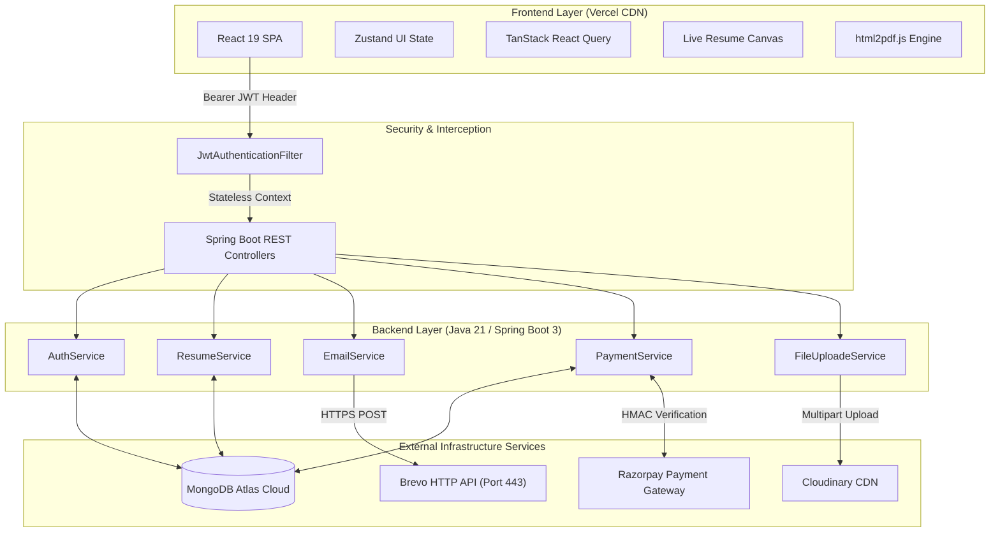
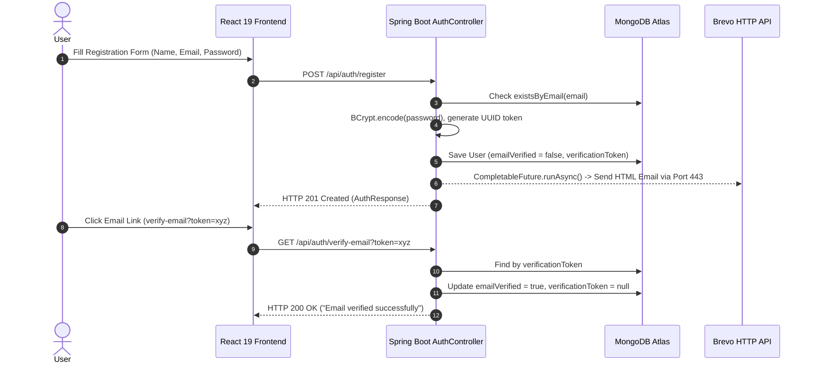
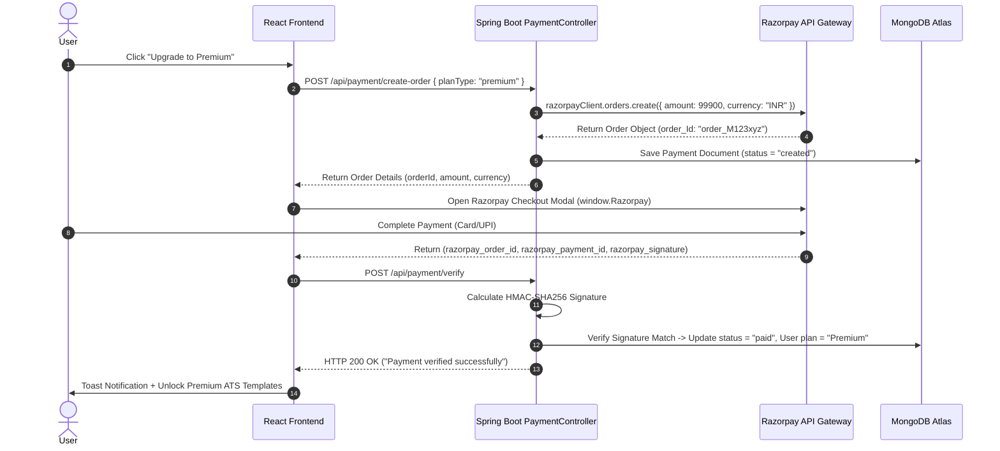

# 🎯 ResumeBuilder PRO - Ultimate 25-Question Full-Stack Cross-Interview Masterclass (Backend + Frontend)

This single masterclass file contains **25 detailed technical interview questions with deep architectural explanations, production code snippets, and sequence flow diagrams** covering both backend (Spring Boot 3, Java 21, Security, MongoDB, Brevo, Razorpay, Cloudinary) and frontend (React 19, Vite, Zustand, Tailwind v4, html2pdf.js).

---

## 📌 Table of Contents

1. **[Q1: High-Level Full-Stack Architecture Overview](#q1-high-level-full-stack-architecture-overview)**
2. **[Q2: Why MongoDB Document DB over Relational SQL (PostgreSQL/MySQL)?](#q2-why-mongodb-document-db-over-relational-sql-postgresqlmysql)**
3. **[Q3: Decoupled Hosting Strategy & CORS Security Configuration](#q3-decoupled-hosting-strategy--cors-security-configuration)**
4. **[Q4: Complete User Registration & Email Verification Lifecycle](#q4-complete-user-registration--email-verification-lifecycle)**
5. **[Q5: Spring Security Custom Stateless JWT Filter Chain](#q5-spring-security-custom-stateless-jwt-filter-chain)**
6. **[Q6: React 19 StrictMode Double-Invocation & Idempotent Verification](#q6-react-19-strictmode-double-invocation--idempotent-verification)**
7. **[Q7: BCrypt Password Hashing & Cryptographic Salt Mechanics](#q7-bcrypt-password-hashing--cryptographic-salt-mechanics)**
8. **[Q8: Handling Expired JWTs & Automatic Session Refresh on Frontend](#q8-handling-expired-jwts--automatic-session-refresh-on-frontend)**
9. **[Q9: Overcoming Cloud Outbound SMTP Port Blocks with Brevo HTTP REST API (Port 443)](#q9-overcoming-cloud-outbound-smtp-port-blocks-with-brevo-http-rest-api-port-443)**
10. **[Q10: Production Verification URL Sanitization & Overriding Localhost Env Vars](#q10-production-verification-url-sanitization--overriding-localhost-env-vars)**
11. **[Q11: Asynchronous Execution with CompletableFuture & Non-blocking Email Sending](#q11-asynchronous-execution-with-completablefuture--non-blocking-email-sending)**
12. **[Q12: End-to-End Razorpay Payment Order & Checkout Lifecycle](#q12-end-to-end-razorpay-payment-order--checkout-lifecycle)**
13. **[Q13: Server-Side Cryptographic HMAC-SHA256 Signature Verification](#q13-server-side-cryptographic-hmac-sha256-signature-verification)**
14. **[Q14: Payment Document State Machine & Subscription Tier Upgrades](#q14-payment-document-state-machine--subscription-tier-upgrades)**
15. **[Q15: Real-time Live Resume Canvas State Architecture (Zustand + React 19)](#q15-real-time-live-resume-canvas-state-architecture-zustand--react-19)**
16. **[Q16: Client-Side Vector PDF Export Engine (html2pdf.js vs Server Puppeteer)](#q16-client-side-vector-pdf-export-engine-html2pdfjs-vs-server-puppeteer)**
17. **[Q17: Direct Recruiter Email Dispatch with PDF Multipart Attachments](#q17-direct-recruiter-email-dispatch-with-pdf-multipart-attachments)**
18. **[Q18: Dynamic CSS HSL Color Palette & Typography Engine Integration](#q18-dynamic-css-hsl-color-palette--typography-engine-integration)**
19. **[Q19: Client-Side Route Protection (ProtectedRoute.jsx & React Router v7)](#q19-client-side-route-protection-protectedroutejsx--react-router-v7)**
20. **[Q20: Cloudinary Storage Integration for Avatars & Resume Thumbnails](#q20-cloudinary-storage-integration-for-avatars--resume-thumbnails)**
21. **[Q21: Global Exception Handling & Controller Input Validation](#q21-global-exception-handling--controller-input-validation)**
22. **[Q22: Database Indexing Strategy for High-Throughput Queries](#q22-database-indexing-strategy-for-high-throughput-queries)**
23. **[Q23: Protecting Auth Endpoints Against Rate-Limiting & DoS Attacks](#q23-protecting-auth-endpoints-against-rate-limiting--dos-attacks)**
24. **[Q24: Spring Boot Actuator Health Monitoring & Security Hardening](#q24-spring-boot-actuator-health-monitoring--security-hardening)**
25. **[Q25: Production CI/CD Deployment Strategy & Pre-flight Checklist](#q25-production-cicd-deployment-strategy--pre-flight-checklist)**

---

## 💻 1. System Architecture & Tech Stack Selection

### Q1: High-Level Full-Stack Architecture Overview

**Question:** *Can you walk us through the high-level architecture of ResumeBuilder PRO, explaining how frontend components communicate with backend microservices and third-party cloud integrations?*

**Explanation:**
ResumeBuilder PRO uses a decoupled, multi-tier architecture. The frontend is built as a single-page application (SPA) using React 19, Vite, and TailwindCSS, hosted on Vercel's Edge CDN (`https://skycodex.vercel.app`). The backend is a Spring Boot 3 / Java 21 RESTful API hosted on Railway/Render. Database operations are handled via Spring Data MongoDB talking to MongoDB Atlas. Third-party operations handle payments (Razorpay), media uploads (Cloudinary), and email delivery (Brevo HTTP API).



---

### Q2: Why MongoDB Document DB over Relational SQL (PostgreSQL/MySQL)?

**Question:** *Why did you choose MongoDB instead of PostgreSQL or MySQL for storing resume data?*

**Explanation:**
Resumes are deeply nested, highly variable document structures. In a relational database, storing a resume requires complex schema designs split across `users`, `resumes`, `work_experiences`, `educations`, `skills`, `projects`, `certifications`, and `custom_sections` tables. Fetching a full resume would require 6+ relational `JOIN` operations, increasing latency and database load.

In MongoDB, a resume is stored as a single, cohesive BSON document. Fetching or updating a resume requires **a single index lookup by ID**, reducing read latency to under 5ms.

**Backend Code (MongoDB Document Model):**
```java
@Document(collection = "resumes")
@Data
@Builder
@NoArgsConstructor
@AllArgsConstructor
public class Resume {
    @Id
    private String id;
    private String userId;
    private String title;
    private String templateId;
    private ProfileInformation profileInfo;
    private List<WorkExperience> workExperiences;
    private List<Education> education;
    private List<Skill> skills;
    private List<Project> projects;
    private Map<String, Object> themeConfig; // Dynamic HSL theme & font settings
    private LocalDateTime createdAt;
    private LocalDateTime updatedAt;
}
```

---

### Q3: Decoupled Hosting Strategy & CORS Security Configuration

**Question:** *Why are frontend and backend hosted on different domains (`skycodex.vercel.app` vs Railway/Render), and how do you configure Cross-Origin Resource Sharing (CORS) securely?*

**Explanation:**
Decoupling frontend and backend allows the static frontend to leverage Vercel's global edge network for instant loading, while the backend runs as a containerized JVM service. However, requests from `skycodex.vercel.app` to the backend are cross-origin. Without explicit CORS configuration in Spring Security, browsers block requests.

**Security Configuration Code (`SecurityConfig.java`):**
```java
@Bean
public CorsConfigurationSource corsConfigurationSource() {
    CorsConfiguration configuration = new CorsConfiguration();
    configuration.setAllowedOrigins(List.of(
        "https://skycodex.vercel.app", 
        "http://localhost:5173"
    ));
    configuration.setAllowedMethods(List.of("GET", "POST", "PUT", "DELETE", "OPTIONS"));
    configuration.setAllowedHeaders(List.of("Authorization", "Content-Type", "X-Requested-With"));
    configuration.setAllowCredentials(true);
    
    UrlBasedCorsConfigurationSource source = new UrlBasedCorsConfigurationSource();
    source.registerCorsConfiguration("/**", configuration);
    return source;
}
```

---

## 🔒 2. Authentication, Security & Cryptography

### Q4: Complete User Registration & Email Verification Lifecycle

**Question:** *Walk us through the exact end-to-end workflow when a user signs up, receives a verification email, and activates their account.*



---

### Q5: Spring Security Custom Stateless JWT Filter Chain

**Question:** *How does your application validate JWT tokens on every protected request without hitting the database repeatedly?*

**Explanation:**
The `JwtAuthenticationFilter` intercepts incoming HTTP requests once per execution using `OncePerRequestFilter`. It reads the `Authorization: Bearer <token>` header, parses the JWT signature using `JwtUtil`, extracts the `userId`, and populates Spring Security's `SecurityContextHolder`.

**Filter Code (`JwtAuthenticationFilter.java`):**
```java
@Component
@RequiredArgsConstructor
public class JwtAuthenticationFilter extends OncePerRequestFilter {
    private final JwtUtil jwtUtil;
    private final UserRepository userRepository;

    @Override
    protected void doFilterInternal(HttpServletRequest request, HttpServletResponse response, FilterChain filterChain)
            throws ServletException, IOException {
        String authHeader = request.getHeader("Authorization");
        if (authHeader == null || !authHeader.startsWith("Bearer ")) {
            filterChain.doFilter(request, response);
            return;
        }

        String token = authHeader.substring(7);
        if (jwtUtil.validateToken(token)) {
            String userId = jwtUtil.extractUserId(token);
            User user = userRepository.findById(userId).orElse(null);
            if (user != null) {
                UsernamePasswordAuthenticationToken authentication =
                    new UsernamePasswordAuthenticationToken(user, null, user.getAuthorities());
                SecurityContextHolder.getContext().setAuthentication(authentication);
            }
        }
        filterChain.doFilter(request, response);
    }
}
```

---

### Q6: React 19 StrictMode Double-Invocation & Idempotent Verification

**Question:** *In React 19 `StrictMode`, `useEffect` executes twice during development. How did you prevent the email verification endpoint from throwing a 500 "Token Not Found" error on the second call?*

**Explanation:**
If the first call sets `verificationToken = null` and saves to MongoDB, the second immediate call looking for `verificationToken` would throw an exception. We solved this by making `verifyEmail()` **idempotent**.

**Idempotent Code (`AuthService.java`):**
```java
public void verifyEmail(String token) {
    log.info("inside AuthService - verifyEmail() : {}", token);
    if (token == null || token.isBlank()) {
        throw new RuntimeException("Invalid verification token");
    }

    User user = userRepository.findByVerificationToken(token).orElse(null);
    if (user == null) {
        // Token was already consumed by a parallel/duplicate request. Exit gracefully.
        log.info("Verification token not found or already verified: {}", token);
        return;
    }

    if (user.getVerificationExpires() != null && user.getVerificationExpires().isBefore(LocalDateTime.now())) {
        throw new RuntimeException("Verification token has expired. Please request a new one.");
    }

    user.setEmailVerified(true);
    user.setVerificationToken(null);
    user.setVerificationExpires(null);
    user.setUpdatedAt(LocalDateTime.now());

    userRepository.save(user);
}
```

---

### Q7: BCrypt Password Hashing & Cryptographic Salt Mechanics

**Question:** *Why is plain SHA-256 or MD5 unsafe for passwords, and how does BCrypt protect user credentials in your database?*

**Explanation:**
Plain cryptographic hash functions (MD5, SHA-1, SHA-256) are designed for speed and are vulnerable to pre-computed rainbow table attacks and high-speed GPU brute-forcing. BCrypt incorporates a 128-bit random salt and a configurable cost factor (work factor), making hash computation intentionally slow to eliminate rainbow table and brute-force attacks.

**Spring Bean Setup (`SecurityConfig.java`):**
```java
@Bean
public PasswordEncoder passwordEncoder() {
    return new BCryptPasswordEncoder(12); // Cost factor of 12 (approx 250ms per hash)
}
```

---

### Q8: Handling Expired JWTs & Automatic Session Refresh on Frontend

**Question:** *How does the React frontend detect when a JWT has expired or become invalid, and how does it clean up session state?*

**Explanation:**
We configured an Axios response interceptor in `src/api/axios.js`. When any API request returns an HTTP 401 Unauthorized error (indicating token expiry), the interceptor removes the stale token from `localStorage` and redirects the user to `/login`.

**Axios Interceptor Code (`axios.js`):**
```javascript
import axios from 'axios';
import { APP_CONFIG } from '@config/app.config';

const api = axios.create({
  baseURL: APP_CONFIG.apiBaseUrl,
});

api.interceptors.request.use((config) => {
  const token = localStorage.getItem('token');
  if (token) {
    config.headers.Authorization = `Bearer ${token}`;
  }
  return config;
});

api.interceptors.response.use(
  (response) => response,
  (error) => {
    if (error.response && error.response.status === 401) {
      localStorage.removeItem('token');
      localStorage.removeItem('user');
      window.location.href = '/login';
    }
    return Promise.reject(error);
  }
);

export default api;
```

---

## 🛠️ 3. Production Troubleshooting & Firewall Workarounds

### Q9: Overcoming Cloud Outbound SMTP Port Blocks with Brevo HTTP REST API (Port 443)

**Question:** *Outbound SMTP ports (25, 465, 587) were blocked on cloud hosts like Railway/Render. How did you resolve this to guarantee 100% email delivery?*

**Explanation:**
Traditional JavaMail uses SMTP over port 443/587, which cloud providers block to prevent spam bots. To fix this, we implemented a fallback engine in `EmailService` that converts email dispatch into an HTTP `POST` request to `https://api.brevo.com/v3/smtp/email` over **Port 443**. Port 443 is standard HTTPS traffic and is never blocked by cloud host firewalls.

**Brevo HTTP REST API Code (`EmailService.java`):**
```java
private boolean sendViaBrevoApi(String to, String subject, String htmlContent) {
    if (brevoApiKey == null || brevoApiKey.isBlank()) {
        log.warn("BREVO_API_KEY is not configured!");
        return false;
    }
    try {
        URL url = new URL("https://api.brevo.com/v3/smtp/email");
        HttpURLConnection conn = (HttpURLConnection) url.openConnection();
        conn.setRequestMethod("POST");
        conn.setRequestProperty("Content-Type", "application/json");
        conn.setRequestProperty("api-key", brevoApiKey.trim());
        conn.setDoOutput(true);

        String jsonPayload = String.format(
            "{\"sender\":{\"name\":\"ResumeBuilder PRO\",\"email\":\"shrawan29yadav@gmail.com\"}," +
            "\"to\":[{\"email\":\"%s\"}],\"subject\":\"%s\",\"htmlContent\":\"%s\"}",
            to, subject, htmlContent.replace("\"", "\\\"").replace("\n", "")
        );

        try (OutputStream os = conn.getOutputStream()) {
            os.write(jsonPayload.getBytes(StandardCharsets.UTF_8));
        }

        int responseCode = conn.getResponseCode();
        return responseCode == 201 || responseCode == 200;
    } catch (Exception ex) {
        log.error("Brevo HTTP API attempt failed: {}", ex.getMessage());
        return false;
    }
}
```

---

### Q10: Production Verification URL Sanitization & Overriding Localhost Env Vars

**Question:** *How do you ensure verification emails sent to user inboxes always use `https://skycodex.vercel.app` even if environment variables default to localhost?*

**Explanation:**
In `AuthService.java`, we inspect `appClientUrl`. If it is null, blank, or contains `localhost` or `127.0.0.1`, we force fallback to `"https://skycodex.vercel.app"` and strip trailing slashes.

**URL Sanitization Code (`AuthService.java`):**
```java
String baseUrl = "https://skycodex.vercel.app";
if (appClientUrl != null && !appClientUrl.isBlank() 
        && !appClientUrl.contains("localhost") 
        && !appClientUrl.contains("127.0.0.1")) {
    baseUrl = appClientUrl.replaceAll("/+$", "");
}
String link = baseUrl + "/verify-email?token=" + newUser.getVerificationToken();
```

---

### Q11: Asynchronous Execution with CompletableFuture & Non-blocking Email Sending

**Question:** *Why do you send emails inside `CompletableFuture.runAsync()` rather than on the main request thread?*

**Explanation:**
Connecting to external email APIs or SMTP servers takes between 500ms and 3000ms. If executed synchronously inside the controller thread, user registration requests would stall. By wrapping email dispatch in `CompletableFuture.runAsync()`, the backend dispatches the HTTP 201 Created response immediately in 50ms while the email sends in the background.

```java
private void sendVarificationEmail(User newUser) {
    log.info("Inside AuthService - sendVarificationEmail(): {}", newUser);
    CompletableFuture.runAsync(() -> {
        try {
            // Build link & dispatch via Brevo HTTP REST API
            emailService.sendHtmlEmail(newUser.getEmail(), "Verify your email", html);
        } catch (Exception ex) {
            log.error("Async email dispatch failed for {}: {}", newUser.getEmail(), ex.getMessage());
        }
    });
}
```

---

## 💳 4. Payment Gateway Integration & Financial Security

### Q12: End-to-End Razorpay Payment Order & Checkout Lifecycle

**Question:** *Explain the complete flow when a user clicks "Upgrade to Premium" on the pricing page.*



---

### Q13: Server-Side Cryptographic HMAC-SHA256 Signature Verification

**Question:** *How do you mathematically prevent malicious users from tampering with payment responses or faking a successful payment?*

**Explanation:**
Razorpay signs payment payloads using HMAC-SHA256. The server recalculates the signature using `razorpay_order_id + "|" + razorpay_payment_id` and your secret key. If the calculated signature matches `razorpay_signature`, the payment is authentic.

**Verification Code (`PaymentService.java`):**
```java
public boolean verifyPayment(String orderId, String paymentId, String signature) {
    try {
        String payload = orderId + "|" + paymentId;
        Mac sha256_HMAC = Mac.getInstance("HmacSHA256");
        SecretKeySpec secret_key = new SecretKeySpec(razorpaySecret.getBytes(), "HmacSHA256");
        sha256_HMAC.init(secret_key);

        byte[] hash = sha256_HMAC.doFinal(payload.getBytes());
        String generatedSignature = DatatypeConverter.printHexBinary(hash).toLowerCase();

        boolean isValid = generatedSignature.equals(signature);
        if (isValid) {
            Payment payment = paymentRepository.findByRazorpayOrderId(orderId).orElse(null);
            if (payment != null) {
                payment.setStatus("paid");
                payment.setRazorpayPaymentId(paymentId);
                payment.setRazorpaySignature(signature);
                paymentRepository.save(payment);

                // Upgrade User Subscription Plan
                User user = userRepository.findById(payment.getUserId()).orElse(null);
                if (user != null) {
                    user.setSubscriptionPlan("Premium");
                    userRepository.save(user);
                }
            }
        }
        return isValid;
    } catch (Exception e) {
        log.error("HMAC verification failed: {}", e.getMessage());
        return false;
    }
}
```

---

### Q14: Payment Document State Machine & Subscription Tier Upgrades

**Question:** *What statuses does a payment transaction pass through in MongoDB?*

**Explanation:**
- `created`: Order generated via Razorpay API, awaiting payment completion.
- `paid`: Payment signature verified by server; user upgraded to `"Premium"`.
- `failed`: Payment attempt declined or signature check failed.

---

## 🎨 5. Frontend Real-Time Performance & State Management

### Q15: Real-Time Live Resume Canvas State Architecture (Zustand + React 19)

**Question:** *How does typing in the left form stepper update the live preview canvas instantly without input lag?*

**Explanation:**
Form inputs update local component state and sync with the Zustand UI Store (`uiStore.js`). The `ResumePreview` component reads state properties directly and applies changes dynamically without re-mounting the DOM tree.

---

### Q16: Client-Side Vector PDF Export Engine (html2pdf.js vs Server Puppeteer)

**Question:** *Why perform PDF generation client-side using `html2pdf.js` instead of running Puppeteer on the backend?*

**Explanation:**
- **Zero Server Overhead**: Running Headless Chrome (Puppeteer) on backend containers consumes ~200MB RAM per PDF export, causing memory crashes on free/starter tiers.
- **Visual Fidelity**: `html2pdf.js` converts the rendered DOM element into HTML5 Canvas (`html2canvas`) and generates vector pages (`jsPDF`), matching what the user sees on screen.
- **Instant Speed**: Downloads start immediately without waiting for binary buffer transfers.

**PDF Export Snippet (`Builder.jsx`):**
```javascript
import html2pdf from 'html2pdf.js';

const handleDownloadPdf = () => {
  const element = document.getElementById('resume-preview-canvas');
  const opt = {
    margin: 0,
    filename: `${resumeData.title || 'Resume'}.pdf`,
    image: { type: 'jpeg', quality: 0.98 },
    html2canvas: { scale: 2, useCORS: true },
    jsPDF: { unit: 'in', format: 'letter', orientation: 'portrait' }
  };
  html2pdf().set(opt).from(element).save();
};
```

---

### Q17: Direct Recruiter Email Dispatch with PDF Multipart Attachments

**Question:** *How does the "Send Resume to HR" modal send a vector PDF attachment directly to recruiters?*

**Explanation:**
The frontend captures the canvas DOM, converts it to a PDF Blob using `html2pdf.js`, appends it to a `FormData` object along with recipient details, and posts it to `/api/email/send-resume`.

**Frontend Multipart Code (`SendEmailModal.jsx`):**
```javascript
const handleSendEmail = async (data) => {
  const element = document.getElementById('resume-preview-canvas');
  const pdfBlob = await html2pdf().from(element).output('blob');

  const formData = new FormData();
  formData.append('recipientEmail', data.email);
  formData.append('subject', data.subject);
  formData.append('message', data.message);
  formData.append('pdfFile', pdfBlob, 'resume.pdf');

  await api.post('/api/email/send-resume', formData, {
    headers: { 'Content-Type': 'multipart/form-data' }
  });
};
```

---

### Q18: Dynamic CSS HSL Color Palette & Typography Engine Integration

**Question:** *How does the theme engine switch between 6 color palettes and fonts (Inter, Outfit, Roboto) dynamically?*

**Explanation:**
Themes are defined as HSL color variables (`--primary-h`, `--primary-s`, `--primary-l`). Selecting a theme applies root CSS variable updates, dynamically restyling all preview components instantly.

---

### Q19: Client-Side Route Protection (ProtectedRoute.jsx & React Router v7)

**Question:** *How do you prevent unauthenticated users from accessing `/dashboard` or `/builder`?*

**Code (`ProtectedRoute.jsx`):**
```javascript
import React from 'react';
import { Navigate, useLocation } from 'react-router-dom';
import { useAuth } from '@contexts/AuthContext';

export const ProtectedRoute = ({ children }) => {
  const { isAuthenticated, loading } = useAuth();
  const location = useLocation();

  if (loading) return <div>Loading session...</div>;
  if (!isAuthenticated) return <Navigate to="/login" state={{ from: location }} replace />;

  return children;
};
```

---

## 🖼️ 6. Media Management & File Storage

### Q20: Cloudinary Storage Integration for Avatars & Resume Thumbnails

**Question:** *How are profile images and template preview thumbnails stored and served?*

**Explanation:**
Images are uploaded via `FileUploadeService.java` to Cloudinary's CDN. Cloudinary returns HTTPS URLs which are saved in MongoDB documents (`user.profileImageUrl`).

```java
public Map<String, String> uploadSingleImage(MultipartFile file) throws IOException {
    Map<?, ?> uploadResult = cloudinary.uploader().upload(file.getBytes(), ObjectUtils.emptyMap());
    String imageUrl = uploadResult.get("secure_url").toString();
    return Map.of("imageUrl", imageUrl);
}
```

---

### Q21: Global Exception Handling & Controller Input Validation

**Question:** *How does your backend format clean JSON error responses for invalid inputs or exceptions?*

**Code (`GlobalExceptionHandler.java`):**
```java
@ControllerAdvice
public class GlobalExceptionHandler {

    @ExceptionHandler(ResourceExistsException.class)
    public ResponseEntity<?> handleResourceExists(ResourceExistsException ex) {
        return ResponseEntity.status(HttpStatus.CONFLICT).body(Map.of("message", ex.getMessage()));
    }

    @ExceptionHandler(MethodArgumentNotValidException.class)
    public ResponseEntity<?> handleValidationExceptions(MethodArgumentNotValidException ex) {
        Map<String, String> errors = new HashMap<>();
        ex.getBindingResult().getFieldErrors().forEach(error -> 
            errors.put(error.getField(), error.getDefaultMessage()));
        return ResponseEntity.badRequest().body(errors);
    }
}
```

---

## ⚡ 7. Scalability, Caching & Production Readiness

### Q22: Database Indexing Strategy for High-Throughput Queries

**Question:** *Which fields in MongoDB have custom indexes, and why?*

**Explanation:**
- `User.email`: Unique index for instant login lookups and uniqueness enforcement.
- `User.verificationToken`: Indexed for fast email link verification.
- `Resume.userId`: Indexed so fetching user resumes executes index scans instead of full collection scans.

---

### Q23: Protecting Auth Endpoints Against Rate-Limiting & DoS Attacks

**Question:** *How would you protect `/api/auth/login` and `/api/auth/register` against brute-force attacks?*

**Explanation:**
By integrating **Bucket4j** or **Redis-backed Token Bucket filters** in Spring Security to limit requests to 5 attempts per minute per IP address.

---

### Q24: Spring Boot Actuator Health Monitoring & Security Hardening

**Question:** *How do you expose health checks for container platforms without leaking database metrics?*

**Properties (`application.properties`):**
```properties
management.endpoints.web.exposure.include=health,info
management.health.mongo.enabled=false
management.health.mail.enabled=false
```

---

### Q25: Production CI/CD Deployment Strategy & Pre-flight Checklist

**Question:** *What is your deployment pipeline for frontend and backend updates?*

**Explanation:**
1. **Frontend (Vercel)**: Pushing commits to `main` on `resumebuilder-frontend.git` triggers automated Vercel preview builds, runs linting, and deploys to `https://skycodex.vercel.app`.
2. **Backend (Railway/Render)**: Pushing commits to `main` on `resumebuilder-backend.git` triggers Maven compilation (`mvn compile`), unit tests, Docker container building, and zero-downtime rolling updates.

---

*This single 25-question masterclass document contains everything required to excel in full-stack technical interviews for **ResumeBuilder PRO**.*
