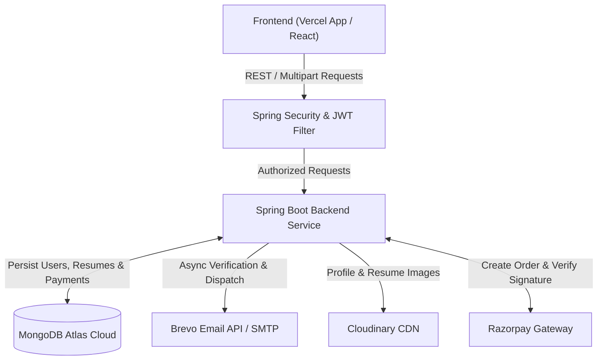

# ResumeBuilder PRO - Backend API Service

A robust, enterprise-grade Spring Boot 3 RESTful API backend for **ResumeBuilder PRO SaaS**. Built with Java 21, Spring Security, MongoDB, JWT authentication, Cloudinary, Razorpay payment gateway, and Brevo email integration.

---

## 🏗️ Architecture & Backend Execution Flow



### 1. Authentication & Security Flow
1. **Registration (`POST /api/auth/register`)**:
   - Validates user input (`RegisterRequest`).
   - Checks email uniqueness in MongoDB.
   - Encrypts password using `BCryptPasswordEncoder`.
   - Generates a 24-hour expiration `verificationToken` (UUID).
   - Asynchronously dispatches a styled HTML email with a verification link (`https://skycodex.vercel.app/verify-email?token=...`) via `Brevo HTTP API` (bypassing port blocks).
2. **Email Verification (`GET /api/auth/verify-email`)**:
   - Validates verification token and expiry time.
   - Sets `emailVerified = true` and clears token.
3. **Login (`POST /api/auth/login`)**:
   - Validates credentials and checks if `emailVerified == true`.
   - Generates a stateless signed JWT token containing user ID.
4. **Stateless Request Authorization**:
   - `JwtAuthenticationFilter` intercepts incoming requests, validates `Authorization: Bearer <token>`, loads `User` from MongoDB, and sets `SecurityContextHolder`.

---

### 2. Resume Management Flow
- **CRUD Operations (`/api/resumes`)**:
  - Authenticated users can create, view, update, and delete resume documents.
  - Ownership is strictly enforced; users can only query/modify their own resumes.
- **Media Uploads (`/api/resumes/{id}/upload-images`)**:
  - Multipart image payloads are processed asynchronously by `FileUploadeService` and stored on Cloudinary.
  - Image URLs (profile photo & template thumbnail) are updated in the MongoDB resume document.

---

### 3. Direct Email Dispatch Flow (`/api/email/send-resume`)
- Enables job seekers to send their updated resume PDF directly to HR managers/recruiters from within the application.
- Accepts `recipientEmail`, `subject`, `message`, and the vector `pdfFile` via multipart upload.
- Uses `EmailService` to deliver the email via Brevo REST HTTP API (Port 443).

---

### 4. Payment & Subscription Upgrade Flow (`/api/payment`)
1. **Order Creation (`POST /api/payment/create-order`)**:
   - Creates a Razorpay Order ID for `premium` subscription.
   - Stores payment record in MongoDB with status `created`.
2. **Signature Verification (`POST /api/payment/verify`)**:
   - Computes HMAC-SHA256 hash using `razorpay_order_id` + `|` + `razorpay_payment_id` and secret key.
   - Compares with `razorpay_signature`.
   - On success, updates payment status to `paid` and upgrades user `subscriptionPlan` to `"Premium"`.

---

## 📡 API Controllers & Endpoint Reference

### 🔐 1. Authentication Controller (`/api/auth`)
| Method | Endpoint | Auth Required | Description |
| :--- | :--- | :---: | :--- |
| `POST` | `/api/auth/register` | ❌ No | Register a new user account & send verification email |
| `GET` | `/api/auth/verify-email` | ❌ No | Verify email address using token |
| `POST` | `/api/auth/login` | ❌ No | Authenticate user & return JWT token |
| `POST` | `/api/auth/resend-verification` | ❌ No | Resend verification link to user email |
| `GET` | `/api/auth/profile` | 🔑 Yes | Retrieve current authenticated user profile |
| `POST` | `/api/auth/upload-image` | 🔑 Yes | Upload user profile avatar to Cloudinary |

---

### 📄 2. Resume Controller (`/api/resumes`)
| Method | Endpoint | Auth Required | Description |
| :--- | :--- | :---: | :--- |
| `POST` | `/api/resumes` | 🔑 Yes | Create a new resume draft |
| `GET` | `/api/resumes` | 🔑 Yes | List all resumes belonging to current user |
| `GET` | `/api/resumes/{id}` | 🔑 Yes | Get specific resume details by ID |
| `PUT` | `/api/resumes/{id}` | 🔑 Yes | Update existing resume data |
| `DELETE` | `/api/resumes/{id}` | 🔑 Yes | Delete a resume by ID |
| `POST` | `/api/resumes/{id}/upload-images` | 🔑 Yes | Upload resume thumbnail & profile image |

---

### 📧 3. Email Controller (`/api/email`)
| Method | Endpoint | Auth Required | Description |
| :--- | :--- | :---: | :--- |
| `POST` | `/api/email/send-resume` | 🔑 Yes | Send resume PDF to recruiter with custom message |
| `GET` | `/api/email/test` | ❌ No | System health check for email delivery |

---

### 💳 4. Payment Controller (`/api/payment`)
| Method | Endpoint | Auth Required | Description |
| :--- | :--- | :---: | :--- |
| `POST` | `/api/payment/create-order` | 🔑 Yes | Create Razorpay order for Premium upgrade |
| `POST` | `/api/payment/verify` | 🔑 Yes | Verify Razorpay payment HMAC signature |
| `GET` | `/api/payment/history` | 🔑 Yes | Fetch payment billing history for user |
| `GET` | `/api/payment/order/{orderId}` | 🔑 Yes | Retrieve detailed payment transaction by order ID |

---

### 🎨 5. Template Controller (`/api/templates`)
| Method | Endpoint | Auth Required | Description |
| :--- | :--- | :---: | :--- |
| `GET` | `/api/templates` | 🔑 Yes | Fetch available templates based on subscription plan |

---

## ⚙️ Configuration Properties (`application.properties` Keys)

Below is the list of property keys used by the application. Supply your environment variables accordingly in production.

```properties
# MongoDB Database Configuration
spring.data.mongodb.uri=
spring.data.mongodb.database=

# Mail / SMTP Configuration
spring.mail.host=
spring.mail.port=
spring.mail.username=
spring.mail.password=
spring.mail.protocol=
spring.mail.properties.mail.smtp.auth=
spring.mail.properties.mail.smtp.starttls.enable=
spring.mail.properties.mail.smtp.starttls.required=
spring.mail.properties.mail.smtp.ssl.enable=
spring.mail.properties.mail.smtp.ssl.trust=
spring.mail.properties.mail.smtp.socketFactory.port=
spring.mail.properties.mail.smtp.socketFactory.class=
spring.mail.properties.mail.smtp.socketFactory.fallback=
spring.mail.properties.mail.smtp.from=

# Brevo HTTP API Key (Port 443 REST Email Dispatch)
BREVO_API_KEY=
brevo.api.key=

# Application & Client URLs
app.client.url=
app.base.url=

# Cloudinary Storage Configuration
cloudinary.cloud-name=
cloudinary.api-key=
cloudinary.api-secret=

# JWT Token Configuration
jwt.secret=
jwt.expiration=

# Razorpay Payment Gateway Configuration
razorpay.key.id=
razorpay.key.secret=

# Actuator & Monitoring Settings
management.endpoints.web.exposure.include=
management.health.mongo.enabled=
management.health.mail.enabled=
```

---

## 🚀 Building & Running Locally

1. **Prerequisites**: JDK 21+, Maven 3.8+
2. **Compile Project**:
   ```bash
   ./mvnw clean compile
   ```
3. **Run Backend Service**:
   ```bash
   ./mvnw spring-boot:run
   ```
