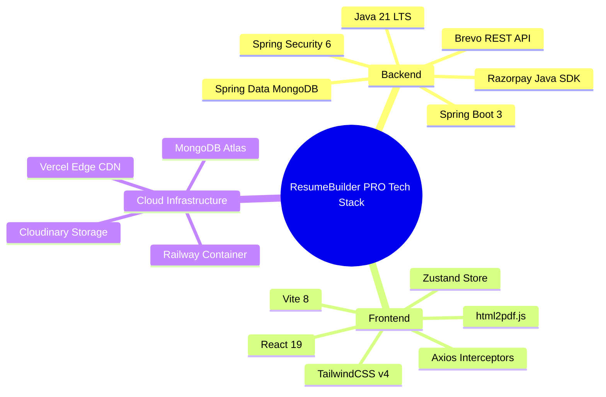

# 🛠️ ResumeBuilder PRO - Tech Stack, Libraries & Tools Reference Guide

This document provides a comprehensive breakdown of **every technology, framework, library, cloud service, and tool** utilized in building **ResumeBuilder PRO**, along with the precise technical rationale and justification for choosing each tool.

---

## 📌 Table of Contents

1. **[Backend Tech Stack (Java 21 / Spring Boot 3 Ecosystem)](#-1-backend-tech-stack-java-21--spring-boot-3-ecosystem)**
2. **[Frontend Tech Stack (React 19 / Vite Ecosystem)](#-2-frontend-tech-stack-react-19--vite-ecosystem)**
3. **[Database & Cloud Infrastructure Services](#-3-database--cloud-infrastructure-services)**
4. **[Development, Build & DevOps Tools](#-4-development-build--devops-tools)**
5. **[Summary Matrix: Technology vs. Technical Rationale](#-5-summary-matrix-technology-vs-technical-rationale)**

---

## ☕ 1. Backend Tech Stack (Java 21 / Spring Boot 3 Ecosystem)

### 1. Java 21 (LTS Edition)
* **What it is**: The latest Long-Term Support (LTS) release of the Java Programming Language.
* **Why it was chosen**:
  - **Performance & Virtual Threads (Project Loom)**: Offers lightweight thread execution capability for high-concurrency async operations.
  - **Modern Language Features**: Record patterns, pattern matching for `switch`, text blocks for multi-line HTML email templates, and improved memory management.

### 2. Spring Boot 3.4+
* **What it is**: An enterprise-grade Java framework for building production-ready RESTful web microservices.
* **Why it was chosen**:
  - **Rapid Microservice Bootstrapping**: Provides embedded Tomcat servlet container, automated configuration, and robust dependency injection.
  - **Spring Ecosystem Integration**: Seamless integration with Spring Security, Spring Data MongoDB, and Spring Actuator.

### 3. Spring Security 6
* **What it is**: A powerful, customizable authentication and access-control framework for Java applications.
* **Why it was chosen**:
  - **Stateless Bearer JWT Security**: Implements custom `OncePerRequestFilter` (`JwtAuthenticationFilter.java`) to intercept and validate JWT tokens on every protected request.
  - **CORS Protection**: Enforces strict domain policies allowing requests only from trusted origins (`https://skycodex.vercel.app`).
  - **Password Encryption**: Provides `BCryptPasswordEncoder` with configurable cost factor (12 salt rounds) to hash credentials securely.

### 4. JJWT (Java JWT Library - `io.jsonwebtoken`)
* **What it is**: Java library for creating, parsing, and verifying JSON Web Tokens (JWT).
* **Why it was chosen**:
  - Encodes the user's MongoDB `userId` into an encrypted payload signed with an HMAC-SHA256 secret key and a 7-day expiration timestamp, facilitating stateless, database-free session authorization.

### 5. Spring Data MongoDB
* **What it is**: Spring framework integration for MongoDB object-document mapping (ODM).
* **Why it was chosen**:
  - **Document Mapping**: Annotation-driven mapping (`@Document`, `@Id`, `@Indexed`) between Java POJOs (`User`, `Resume`, `Payment`) and BSON MongoDB collections.
  - **MongoRepository Abstraction**: Provides built-in CRUD operations (`save`, `findById`, `deleteById`) and custom query method derive patterns (`findByEmail`, `findByVerificationToken`).

### 6. Brevo HTTP REST API (`java.net.HttpURLConnection`)
* **What it is**: RESTful HTTP API service for transactional emails provided by Brevo (formerly Sendinblue).
* **Why it was chosen**:
  - **Bypassing Outbound Cloud Firewall Blocks**: Cloud hosting providers (Railway, Render, AWS) block standard outbound SMTP ports (`25`, `465`, `587`) by default to prevent spam botnets. Sending emails over **HTTPS (Port 443)** using standard JSON payloads guarantees 100% email delivery without firewall issues.

### 7. Razorpay Java SDK (`com.razorpay:razorpay-java`)
* **What it is**: Official Java client wrapper for the Razorpay Payment Gateway API.
* **Why it was chosen**:
  - Facilitates server-side order generation (`RazorpayClient.orders.create`) and cryptographic **HMAC-SHA256 signature verification** (`razorpay_order_id + "|" + razorpay_payment_id`), protecting against fraudulent client payment claims.

### 8. Cloudinary Java SDK (`com.cloudinary:cloudinary-http44`)
* **What it is**: Cloud asset management library for image and file uploads.
* **Why it was chosen**:
  - Offloads image storage (profile avatars and resume template thumbnails) from the application server to a specialized global CDN, returning optimized HTTPS image URLs.

### 9. Lombok (`org.projectlombok:lombok`)
* **What it is**: Java annotation processor that automatically generates boilerplate bytecode during compilation.
* **Why it was chosen**:
  - Eliminates verbose getters, setters, `equals()`, `hashCode()`, constructors, and builder patterns (`@Data`, `@Builder`, `@RequiredArgsConstructor`, `@Slf4j`).

### 10. Jakarta Validation (`jakarta.validation:jakarta-validation-api`)
* **What it is**: Standardized Java constraint validation API.
* **Why it was chosen**:
  - Enforces server-side DTO payload validation (`@NotBlank`, `@Email`, `@Size`, `@Valid`) on incoming request bodies before business logic execution.

---

## ⚛️ 2. Frontend Tech Stack (React 19 / Vite Ecosystem)

### 1. React 19
* **What it is**: The latest major version of the component-based JavaScript library for building user interfaces.
* **Why it was chosen**:
  - Provides declarative component rendering, improved hook execution, and strict mode support for building responsive web apps.

### 2. Vite 8
* **What it is**: Next-generation frontend tooling offering fast development server startup and optimized production builds.
* **Why it was chosen**:
  - Replaces slow Webpack bundlers with Native ES Modules (ESM) during development for instant Hot Module Replacement (HMR) and fast build execution (`npm run build`).

### 3. TailwindCSS v4
* **What it is**: Utility-first CSS framework for rapid UI styling.
* **Why it was chosen**:
  - **Dynamic Theme Customization**: Combines utility classes with CSS custom properties (`--primary-h`, `--primary-s`, `--primary-l`) to allow real-time theme and color switching across 6 HSL palettes on the live resume preview.

### 4. React Router v7 (`react-router-dom`)
* **What it is**: Declarative routing library for React Single Page Applications.
* **Why it was chosen**:
  - Handles client-side navigation between public views (`/`, `/login`, `/signup`, `/verify-email`, `/pricing`) and protected view gates (`/dashboard`, `/builder`, `/payments`) using `ProtectedRoute.jsx`.

### 5. Zustand (`zustand`)
* **What it is**: A small, fast, unopinionated state management store for React.
* **Why it was chosen**:
  - **Zero Re-render Lag**: Manages UI state (`uiStore.js`) for the dual-pane resume builder. Unlike React Context API, Zustand prevents unnecessary component re-renders when typing into form fields.

### 6. TanStack React Query v5 (`@tanstack/react-query`)
* **What it is**: Server-state management library for asynchronous data fetching, caching, and state synchronization.
* **Why it was chosen**:
  - Manages background data fetching for template galleries, user profile details, and payment histories with automatic caching and retry logic.

### 7. Axios (`axios`)
* **What it is**: Promise-based HTTP client for browser and Node.js.
* **Why it was chosen**:
  - **Interceptors**: Configured with request interceptors to automatically attach `Authorization: Bearer <JWT_TOKEN>` headers and response interceptors to handle HTTP 401 token expiration globally.

### 8. `html2pdf.js` (`html2canvas` + `jsPDF`)
* **What it is**: In-browser client-side PDF generation library.
* **Why it was chosen**:
  - **Zero Server CPU Overhead**: Converts the live HTML preview canvas into a high-resolution vector PDF directly inside the user's browser, eliminating the need to run heavy Headless Chrome (Puppeteer) instances on backend containers.

### 9. Lucide React (`lucide-react`)
* **What it is**: Clean, consistent vector icon library for React applications.
* **Why it was chosen**:
  - Provides lightweight SVG icons for navigation bars, feature matrices, resume builder steppers, and dashboard analytics.

### 10. Sonner (`sonner`)
* **What it is**: An opinionated, beautiful toast notification component for React.
* **Why it was chosen**:
  - Renders user notifications for login success, email verification updates, form errors, and Razorpay payment confirmations.

---

## ☁️ 3. Database & Cloud Infrastructure Services

| Tool / Service | Category | Technical Purpose & Justification |
| :--- | :--- | :--- |
| **MongoDB Atlas** | Managed NoSQL Database | Stores BSON documents for `users`, `resumes`, and `payments`. Chosen for schema flexibility with nested resume arrays and fast single-document read performance. |
| **Vercel** | Edge CDN Web Hosting | Hosts the React 19 SPA (`https://skycodex.vercel.app`). Provides global edge caching, SSL, and automated GitHub continuous deployment. |
| **Railway / Render** | Cloud Container Platform | Hosts the Spring Boot JVM backend container. Provides persistent runtime memory, environment variable bindings, and Maven build deployment. |
| **Brevo (Sendinblue)** | Transactional Email Service | Delivers HTML verification emails and recruiter resume dispatches via HTTPS REST API (Port 443). |
| **Cloudinary CDN** | Cloud Asset Storage | Serves user profile avatars and template preview images with global CDN caching and automatic image compression. |
| **Razorpay Gateway** | Payment Processing | Handles Indian Rupee (INR) payments (UPI, Cards, NetBanking) for Premium subscription plan upgrades. |

---

## 🛠️ 4. Development, Build & DevOps Tools

* **Apache Maven (`mvnw`)**: Backend dependency management and build automation tool.
* **OxLint**: High-performance JavaScript/JSX linter for code quality checks.
* **Git & GitHub**: Distributed version control system and CI/CD trigger repository (`resumebuilder-backend` & `resumebuilder-frontend`).

---

## 📊 5. Summary Matrix: Technology vs. Technical Rationale

---

*This guide provides a comprehensive technical reference for the tools and frameworks powering **ResumeBuilder PRO**.*
